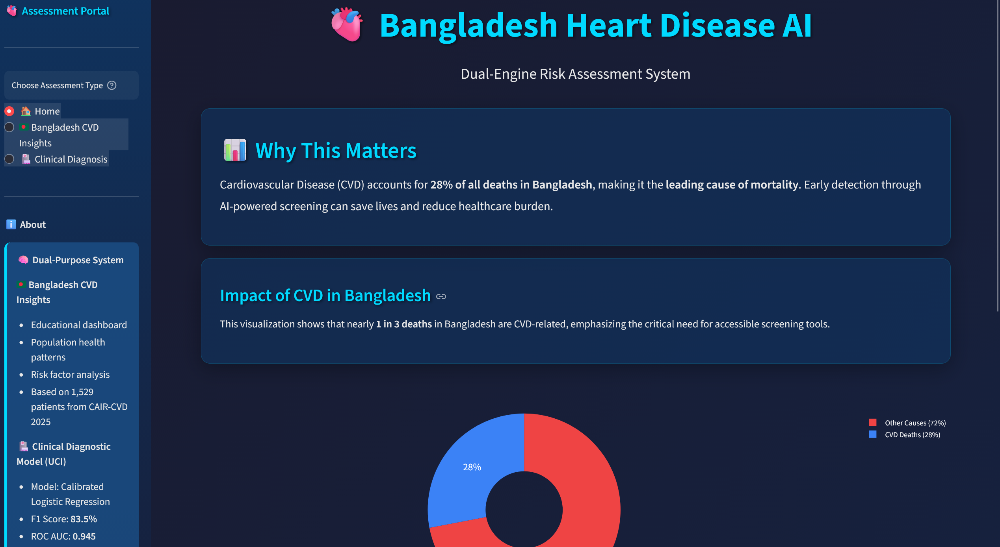
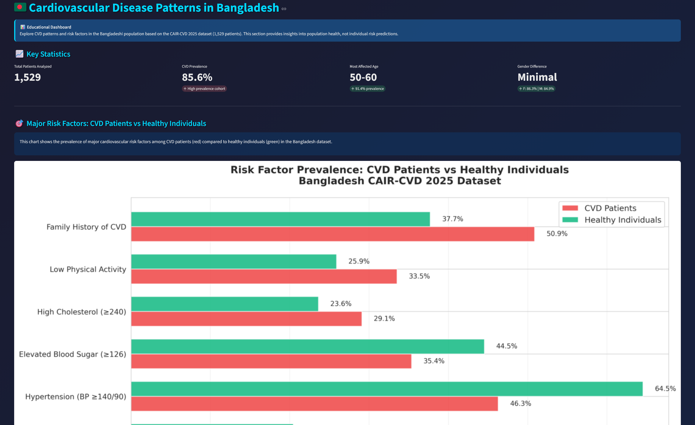
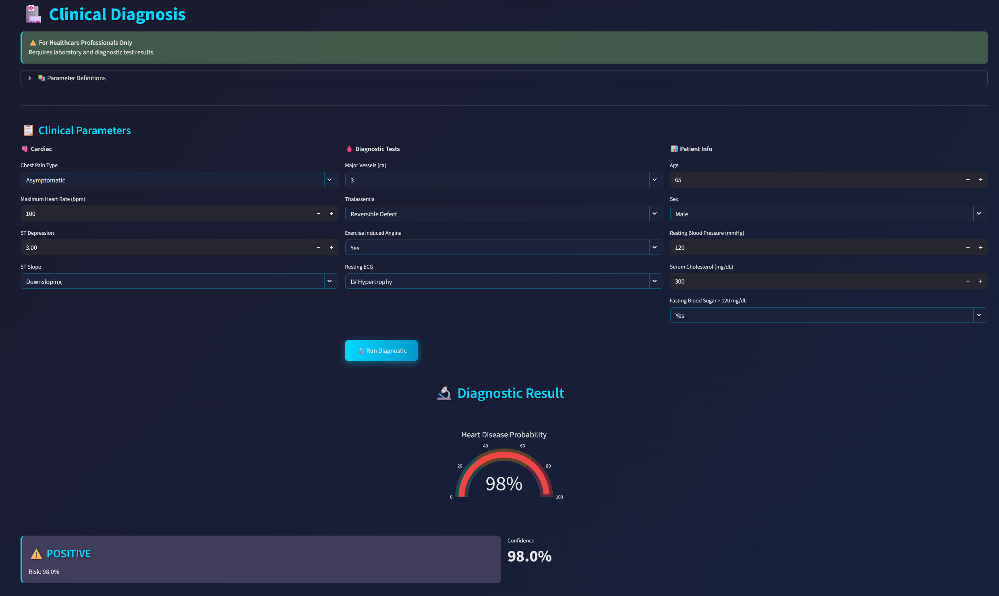

# 🫀 Bangladesh Heart Disease AI

[](https://bangladesh-heart-disease-ai.streamlit.app/)


**A Dual-Engine Cardiovascular Risk Assessment System for Bangladesh**

Early detection of cardiovascular disease (CVD) through AI-powered screening to address the critical health burden in Bangladesh, where CVD accounts for **28% of all deaths**.



---

## Project Overview

The **Bangladesh Heart Disease AI** is a comprehensive web-based platform that combines:

1. **Bangladesh CVD Insights Dashboard** - Educational tool analyzing population health patterns from 1,529 Bangladeshi patients
2. **Clinical Diagnostic Model** - AI-powered risk assessment tool for healthcare professionals using advanced diagnostic parameters


### Why This Matters

- **CVD is the leading cause of death in Bangladesh** (28% of all mortality)
- Early detection can save lives and reduce healthcare burden
- Accessible AI-powered screening tools democratize cardiovascular health assessment
- Data-driven insights help understand population-level risk factors

---

## Features

### Bangladesh CVD Insights Dashboard

- **Interactive Visualizations** of CVD prevalence across age groups and genders
- **Risk Factor Analysis** comparing CVD patients vs healthy individuals
- **Lifestyle Impact Assessment** showing benefits of physical activity
- **Demographic Explorer** for understanding population patterns
- Based on **CAIR-CVD 2025 dataset** (1,529 patients from Bangladesh)

### Clinical Diagnostic Model

- **Calibrated Machine Learning Model** (Logistic Regression)
- **High Performance Metrics:**
  - F1 Score: **83.5%**
  - ROC AUC: **0.945**
  - Brier Score: **0.102** (excellent calibration)
- **Realistic Probability Predictions** for clinical decision support
- Requires advanced diagnostic tests (ECG, cardiac catheterization, thalassemia screening)
- Based on **UCI Heart Disease Dataset** (297 clinical cases)

---

## Live Demo

**[Try the app here](https://bangladesh-heart-disease-ai.streamlit.app/)**
---

## Screenshots

<details>
<summary>Click to view screenshots</summary>

### Home Page


### Bangladesh CVD Insights


### Clinical Diagnosis


</details>

---

## Technology Stack

- **Frontend Framework:** Streamlit
- **Data Processing:** Pandas, NumPy
- **Machine Learning:** Scikit-learn
- **Visualizations:** Plotly, Matplotlib, Seaborn
- **Model:** Calibrated Logistic Regression with StandardScaler

---

## Project Structure

```
heart-disease-dashboard/
│
├── app.py                          
├── requirements.txt                
├── README.md                      
│
├── models/                         
│   ├── heart_disease_model.pkl    
│   ├── feature_names.pkl          
│   └── scaler.pkl                
│
├── insights/                       
│   ├── key_insights.json          
│   ├── demographic_insights.json  
│   ├── lifestyle_impact.json     
│   ├── age_gender_data.json       
│   ├── risk_factors_comparison.png
│   ├── age_gender_patterns.png
│   └── lifestyle_impact.png
│
├── data/                         
│   ├── CVD Dataset.csv
│   ├── heart_disease_clean.csv
│
└── screenshots/                   
    ├── home.png
    ├── bangladesh-insights.png
    └── clinical-diagnosis.png


```

---

## Installation & Setup

### Prerequisites

- Python 3.8 or higher
- pip package manager
- Git

### Local Installation

1. **Clone the repository**
   ```bash
   git clone https://github.com/sadiaa-ops/heart-disease-dashboard.git
   cd heart-disease-dashboard
   ```

2. **Create a virtual environment** (recommended)
   ```bash
   python -m venv venv
   
   # On Windows
   venv\Scripts\activate
   
   # On macOS/Linux
   source venv/bin/activate
   ```

3. **Install dependencies**
   ```bash
   pip install -r requirements.txt
   ```

4. **Run the application**
   ```bash
   streamlit run app.py
   ```

5. **Open in browser**
   
   The app will automatically open at `http://localhost:8501`

---

## Dependencies

```txt
streamlit>=1.28.0
pandas>=2.0.0
numpy>=1.24.0
scikit-learn>=1.3.0
plotly>=5.17.0
matplotlib>=3.7.0
seaborn>=0.12.0
Pillow>=10.0.0
```

---

## Deployment on Streamlit Cloud

### Step 1: Prepare Your Repository

Ensure your repository has:
- `app.py` (main application file)
- `requirements.txt` (all dependencies)
- `models/` folder with trained models
- `insights/` folder with analysis data
- `data/` folder with datasets
### Step 2: Deploy to Streamlit Cloud

1. Go to [share.streamlit.io](https://share.streamlit.io)
2. Sign in with GitHub
3. Click "New app"
4. Select:
   - **Repository:** `sadiaa-ops/heart-disease-dashboard`
   - **Branch:** `main`
   - **Main file path:** `app.py`
5. Click "Deploy!"

The app will be live at: `https://[your-app-name].streamlit.app`

### Step 3: Update README

Once deployed, update the badge at the top of this README with your actual URL.

---

## Data Sources

### 1. CAIR-CVD 2025 Bangladesh Dataset
- **Patients:** 1,529 from Bangladesh
- **Purpose:** Educational insights and population health patterns
- **Features:** Demographics, risk factors, lifestyle indicators, clinical measurements
- **CVD Prevalence:** 85.6% (clinical cohort)

### 2. UCI Heart Disease Dataset
- **Patients:** 297 clinical cases
- **Purpose:** Clinical diagnostic model training
- **Features:** Advanced diagnostic parameters (ECG, cardiac catheterization, thalassemia)
- **Source:** [UCI Machine Learning Repository](https://archive.ics.uci.edu/ml/datasets/heart+disease)

---

## Model Details

### Clinical Diagnostic Model

**Algorithm:** Calibrated Logistic Regression with Platt Scaling

**Training Approach:**
- StandardScaler for feature normalization
- CalibratedClassifierCV with 5-fold cross-validation
- Optimized for realistic probability predictions

**Performance Metrics:**
- **Accuracy:** 85.6%
- **Precision:** 89.2%
- **Recall:** 78.6%
- **F1 Score:** 83.5%
- **ROC AUC:** 0.945
- **Brier Score:** 0.102 (excellent calibration)

**Input Features (13):**
- Age, Sex, Chest Pain Type
- Resting Blood Pressure, Cholesterol
- Fasting Blood Sugar, Resting ECG
- Maximum Heart Rate, Exercise Induced Angina
- ST Depression, ST Slope
- Number of Major Vessels, Thalassemia

---

## Key Insights from Bangladesh Data

### Top Risk Factors

1. **Family History of CVD:** 13.2% higher prevalence in CVD patients
2. **Low Physical Activity:** 7.6% higher prevalence in CVD patients
3. **High Cholesterol (≥240 mg/dL):** 5.5% higher prevalence in CVD patients

### Age Patterns

- **Peak CVD prevalence:** 50-60 age group (91.4%)
- **Lowest prevalence:** Under 30 years (75.0%)
- CVD prevalence increases steadily with age until 60, then declines slightly

### Gender Differences

- **Minimal gender gap:** Female (86.3%) vs Male (84.9%)
- Both genders show similar patterns across age groups

### Lifestyle Impact

High physical activity shows measurable benefits:
- **Systolic BP:** 1.7 mmHg lower
- **Diastolic BP:** 0.9 mmHg lower
- Improved metabolic health markers

---

## Important Disclaimers

### Medical Disclaimer

**This application is a screening tool only and NOT a substitute for professional medical advice, diagnosis, or treatment.**

- The Bangladesh CVD Insights section is for **educational purposes only**
- The Clinical Diagnostic Model is intended for **healthcare professionals** with access to diagnostic tests
- Always consult qualified healthcare providers for personal medical decisions
- In case of emergency, contact local emergency services immediately

### Data Interpretation

- The Bangladesh dataset (85.6% CVD prevalence) represents a clinical cohort seeking cardiovascular care, not a general population sample
- Insights reflect patterns in this specific population and may not generalize to all Bangladeshi citizens
- Individual risk assessment requires comprehensive clinical evaluation

---


</div>